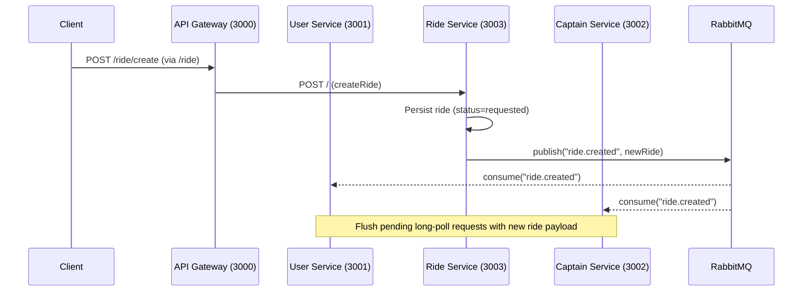

# uber-microbackend
Uber-like backend built with Node.js microservices and RabbitMQ for inter-service messaging. This repo contains three core services (`user/`, `captain/`, `ride/`) and an API Gateway (`gateway/`). Each service has its own Express app, MongoDB connection, and uses JWT-based auth via cookies. RabbitMQ is used to fan-out ride creation events to other services using a simple queue pattern.

## Quick Start

- Install prerequisites
  - Node.js 18+
  - MongoDB (local or cloud)
  - RabbitMQ (local or Docker)
- Create `.env` files (see Environment) for each service
- Install dependencies in each service directory
- Start services: `gateway` → `user` → `captain` → `ride`

## Project Structure

```
uber-microbackend/
├─ gateway/                 # API Gateway (reverse proxy)
│  ├─ app.js                # Proxies /user, /captain, /ride to respective services
│  └─ package.json
├─ user/                    # User service (auth, profile, user ride long-poll)
│  ├─ app.js
│  ├─ server.js             # Port 3001
│  ├─ routes/user.routes.js # /register, /login, /logout, /profile, /rides
│  ├─ controllers/user.controller.js
│  ├─ db/db.js              # Uses MONGO_URL
│  └─ service/rabbit.js     # Uses RABBIT_URL
├─ captain/                 # Captain service (auth, availability, new ride long-poll)
│  ├─ app.js
│  ├─ server.js             # Port 3002
│  ├─ routes/captain.routes.js # /register, /login, /logout, /profile, /toggle-availability, /new-ride
│  ├─ controllers/captain.controller.js
│  ├─ db/db.js
│  └─ service/rabbit.js
├─ ride/                    # Ride service (create/accept/reject ride + publishes events)
│  ├─ app.js
│  ├─ server.js             # Port 3003
│  ├─ routes/ride.routes.js
│  ├─ controllers/ride.controller.js
│  ├─ db/db.js
│  └─ service/rabbit.js
└─ README.md
```

## Services and Ports

- Gateway: http://localhost:3000
  - Proxies:
    - `/user` → http://localhost:3001
    - `/captain` → http://localhost:3002
    - `/ride` → http://localhost:3003
- User Service: http://localhost:3001
- Captain Service: http://localhost:3002
- Ride Service: http://localhost:3003

Gateway proxy is configured in `gateway/app.js`.

## Messaging (RabbitMQ)

- Library: `amqplib`
- Env var: `RABBIT_URL` (e.g., `amqp://localhost`)
- Queue(s):
  - `ride.created` — published by `ride` service on new ride creation; consumed by `user` and `captain` services to notify connected long-poll clients.

All services share the same minimal client in `service/rabbit.js`:
- `connect()` — connects and creates a channel
- `publishToRabbitMQ(queue, payload)` — asserts queue and sends JSON payload
- `subscribeToRabbitMQ(queue, handler)` — asserts queue and invokes `handler` with parsed payload

## Data Flow Overview



Both `user` and `captain` services maintain in-memory queues of pending long-poll HTTP responses. When a `ride.created` message arrives, they flush and respond immediately with the ride payload.

## Environment

Create a `.env` file in each service directory (`user/`, `captain/`, `ride/`) with the following variables:

```
# Common
PORT=300X              # Only used in server files; fixed to 3001/3002/3003 in code
MONGO_URL=
JWT_SECRET=
RABBIT_URL=
```

Example per service:

- user/.env
```
MONGO_URL=
JWT_SECRET=
RABBIT_URL=
```

- captain/.env
```
MONGO_URL=
JWT_SECRET=
RABBIT_URL=
```

- ride/.env
```
MONGO_URL=
JWT_SECRET=
RABBIT_URL=
```

## Install & Run

From the repo root, run these in each service directory:

```
cd gateway && npm install && npm start
cd user && npm install && npm run start
cd captain && npm install && npm run start
cd ride && npm install && npm run dev
```

Notes:
- `gateway`: `npm start` runs `node app.js`
- `user` and `captain`: `npm run start` runs `nodemon server.js` (auto-restarts on changes)
- `ride`: `npm run dev` runs `nodemon server.js` (or use `npm start` for plain Node)

Ensure RabbitMQ is running locally:

```
# Docker (example)
docker run -d --name rabbitmq -p 5672:5672 -p 15672:15672 rabbitmq:3-management
# UI: http://localhost:15672 (guest/guest)
```

## Authentication

- JWT generated on login/register and set as `token` cookie
- Protected routes use middleware to validate JWT and set `req.user` or `req.captain`
- For curl testing, use `-c cookies.txt` and `-b cookies.txt` to persist cookies

## API Reference (via Gateway)

Base URL: `http://localhost:3000`

### User

- POST `/user/register`
  - Body: `{ name, email, password }`
  - Sets `token` cookie; returns `{ token, newUser }`

- POST `/user/login`
  - Body: `{ email, password }`
  - Sets `token` cookie; returns `{ token, user }`

- GET `/user/logout`

- GET `/user/profile` (auth)

- GET `/user/rides` (auth)
  - Long-poll up to ~25s; returns `204` if no new ride or `200 { ride }` when a ride is created

### Captain

- POST `/captain/register`
- POST `/captain/login`
- GET `/captain/logout`
- GET `/captain/profile` (auth)
- PATCH `/captain/toggle-availability` (auth)
- GET `/captain/new-ride` (auth)
  - Long-poll up to ~25s; returns `204` if no new ride or `200 { ride }` when a ride is created

### Ride

The ride routes are mounted at `/` within the ride service and proxied under `/ride` via the gateway. The key controller is `ride/controllers/ride.controller.js`.

- POST `/ride/` (auth as user)
  - Body: `{ pickup, destination }`
  - Persists a ride with `status: "requested"`
  - Publishes `ride.created` event to RabbitMQ with the new ride payload

- POST or PATCH endpoints for `acceptRide` / `rejectRide` are available under `/ride/...` depending on the router; they update ride status to `accepted` or `rejected` respectively.

## Example Usage (curl)

### User flow

```
# Register user
curl -i -c cookies.txt -H "Content-Type: application/json" \
  -d '{"name":"Alice","email":"alice@example.com","password":"pass123"}' \
  http://localhost:3000/user/register

# Long-poll for rides (runs up to ~25s)
curl -i -b cookies.txt http://localhost:3000/user/rides
```

### Captain flow

```
# Register captain
curl -i -c captain.txt -H "Content-Type: application/json" \
  -d '{"name":"Bob","email":"bob@example.com","password":"pass123"}' \
  http://localhost:3000/captain/register

# Become available
curl -i -X PATCH -b captain.txt http://localhost:3000/captain/toggle-availability

# Long-poll for new rides (runs up to ~25s)
curl -i -b captain.txt http://localhost:3000/captain/new-ride
```

### Create a ride (triggers event)

```
# As a logged-in user (uses user cookies from above)
curl -i -b cookies.txt -H "Content-Type: application/json" \
  -d '{"pickup":"A","destination":"B"}' \
  http://localhost:3000/ride/
```

If a captain and/or user long-poll is pending, they will immediately receive the newly created ride data.

## Development Notes

- Long-poll lists (`pendingRidePolls` in `user.controllers` and `pendingPolls` in `captain.controllers`) are in-memory and will reset on server restart. In production, consider WebSockets or a scalable pub/sub mechanism.
- The minimal RabbitMQ client reconnects only on invocation. For resilience, add proper connection lifecycle, backoff, and consumer acknowledgements.
- Ensure consistent validation and error handling on all request bodies.

## Troubleshooting

- RabbitMQ connection error:
  - Verify `RABBIT_URL` (e.g., `amqp://localhost`)
  - Check Docker container is running and ports `5672` and `15672` are exposed

- MongoDB connection error:
  - Verify `MONGO_URL`
  - Ensure local MongoDB is running or Atlas connection string is correct

- Gateway routing not working:
  - Confirm services are running on 3001/3002/3003
  - Check `gateway/app.js` proxy paths

## License

ISC

